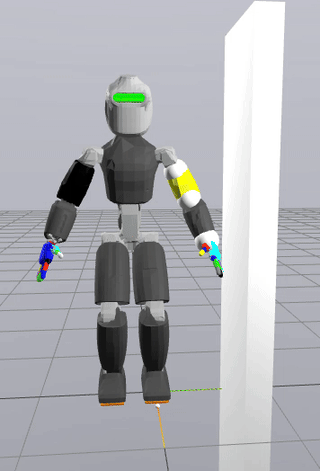

<h1 align="center">
Maximising the tolerance to disturbances via the combined optimisation
of controller and actuation for the robust walking of a humanoid robot
</h1>

<div style="text-align: center;">
<table>
  <tr>
    <td style="text-align: center;"> Baseline gains</td>
    <td style="text-align: center;"> Gain tuning (GT)</td>
    <td style="text-align: center;"> Co-design (CD)</td>
  </tr>
  <tr>
    <td></td>
    <td></td>
    <td></td>
  </tr>
</table>
</div>

## Installation

A quick way to install the dependencies is via [mamba package manager](https://mamba.readthedocs.io/en/latest/index.html). To install all the dependencies,

```sh
mamba env create -f environment.yml
```

To get the correct values corresponding to the hardware of the robot, clone:
```sh
git clone https://github.com/robotology/robots-configuration.git@e5a262e
```

Then clone the current repository:
```sh
git clone https://github.com/ami-iit/paper_sathuluri_2024_ral_sso-dt.git
```

Make sure that the necessary IPOPT solvers are installed and configured correctly. To install the dependencies from IPOPT refer to [this](https://coin-or.github.io/Ipopt/INSTALL.html) or from CasADi via [this](https://github.com/casadi/casadi/wiki/InstallationLinux). The specific HSL packages can also be installed from [here](https://licences.stfc.ac.uk/product/coin-hsl).

## Usage
Activate the created environment, 
```
mamba activate walk_release
```
Before running the actual simulation the `urdf` file needs to be made Drake compatible by running, 
```
python src/urdf2drake.py
cd src
```
Now the actual simulation can be run. To visualise the walking robot with pre-defined design variable values run: [`run_walking_scenario.py`](src/sim_system/)

To run the co-design optimisation problem run,
```sh
time python ergoCub_walking_optimisation.py --workers 48 --generations 500 --population 50 --algo "cmaes" --scenario "both" --randomise_obstacle False --verbosity 10 --seed 0 --add_root_disturbance 1e3 --add_base_noise 0.01 --opt_mode "co_design" --robot_type "harmonic" --comment "Example run for co-design optimisation"
```
This program takes around 4 hr on a 48 core machine with 3.2 GHz clock speed running Kali Linux 2024.1.

If you want to jump right into visualising the robots' walking simulation output, you can do that by opening the file [simulation_output.html](./assets/simulation_output.html).

If you want to setup your own robot for control and design co-optimisation using the pipeline described in the paper, have a look at [CoMoDO](https://github.com/ami-iit/comodo). 

### Maintainer

This repository is maintained by:

| | |
|:---:|:---:|
| [](https://github.com/akhilsathuluri) | [@akhilsathuluri](https://github.com/akhilsathuluri) |
