<h1 align="center">
Maximising tolerance to disturbances via combined control-actuation optimisation
for robust humanoid robot walking
</h1>

<div style="text-align: center;">


<table>
  <tr>
    <td style="text-align: center;"> Disturbance magnitude (external impulse (N), CoM noise (m))</td>
    <td style="text-align: center;"> Baseline robot</td>
    <td style="text-align: center;"> Gain tuning (GT-PB)</td>
    <td style="text-align: center;"> Co-design (CD-PB)</td>
    <td style="text-align: center;"> Co-design (CD-SSDT)</td>
  </tr>
  <tr>
    <td>[0, 0]</td>
    <td>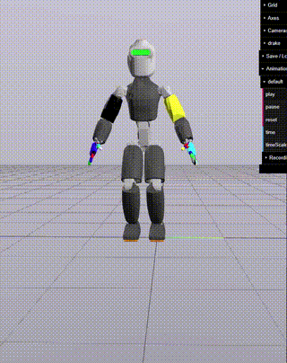</td>
    <td>✅</td>
    <td>✅</td>
    <td>✅</td>
  </tr>
  <tr>
    <td>[0, 0]</td>
    <td>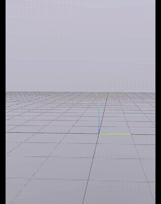</td>
    <td>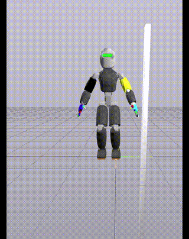</td>
    <td>✅</td>
    <td>✅</td>
  </tr>
  <tr>
    <td>[115, 0.015]</td>
    <td>❌</td>
    <td>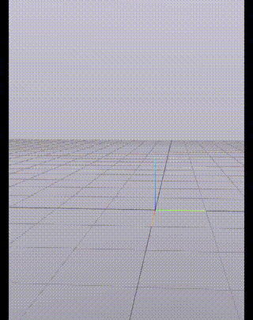</td>
    <td>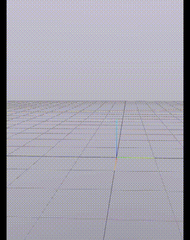</td>
    <td>✅</td>
  </tr>
  <tr>
    <td>[120, 0.02]</td>
    <td>❌</td>
    <td>❌</td>
    <td>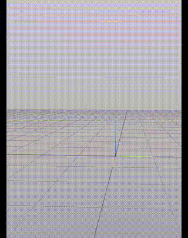</td>
    <td>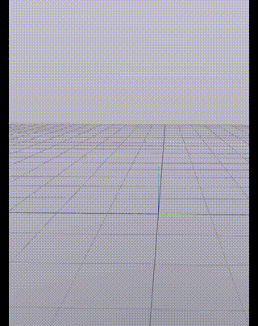</td>
  </tr>
</table>


</div>


## Quickstart to visualising the simulation result

If you want to jump right into visualising the robots' walking simulation output, you can do that by downloading and opening the file [simulation_output.html](./assets/simulation_output.html) in your browser.

## Installation instructions

<details open>
  <summary>Installation using mamba package manager</summary>
A quick way to install the dependencies is via [mamba package manager](https://mamba.readthedocs.io/en/latest/index.html). To install all the dependencies,

```sh
mamba env create -f environment.yml
```

To get the correct values corresponding to the hardware of the robot, clone:
```sh
git clone https://github.com/robotology/robots-configuration.git@e5a262e
```

Then clone the current repository:
```sh
git clone https://github.com/ami-iit/paper_sathuluri_2024_ral_sso-dt.git
```

Make sure that the necessary IPOPT solvers are installed and configured correctly. To install the dependencies from IPOPT refer to [this](https://coin-or.github.io/Ipopt/INSTALL.html) or from CasADi via [this](https://github.com/casadi/casadi/wiki/InstallationLinux). The specific HSL packages can also be installed from [here](https://licences.stfc.ac.uk/product/coin-hsl).
</details>


## Usage

<details open>
  <summary>Setting up the URDF for the first run</summary>
  
Activate the created environment, 
```
mamba activate walk_release
```
Before running the actual simulation the `urdf` file needs to be made Drake compatible by running, 
```
python src/urdf2drake.py
cd src
```
Now the actual simulation can be run. To visualise the walking robot with pre-defined design variable values run: [`visualise_robot_simulation.py`](src/visualise_robot_simulation.py/)

</details>

<details open>
  <summary>Running the point-based optimisation problem</summary>

### Running a co-design point-based optimisation problem
```sh
time python ergoCub_point_based_optimisation.py --generations 500 --population 125 --workers 125 --algo nevergrad_cmaes --seed 42 --add_base_noise 0.02 --add_root_disturbance 3e2 --comment "running point-based optimisation"
```
</details>

<details open>
  <summary>Collecting data around the chosen point-optimum</summary>

### Randomly sampling the space to collect data for training the MLPClassifier
```sh
time python collect_data_buffer.py
```
</details>

<details open>
  <summary>Training the classifier</summary>

### Randomly sampling the space to collect data for training the MLPClassifier
```sh
time python create_classifier.py
```
</details>

<details open>
  <summary>Moving on to the SSDT optimisation</summary>

### Running the set-based optimisation problem 
```sh
time python ergoCub_set_based_optimisation.py --generations 500 --workers 120 --population 120 --nas 50000 --nbs 1000 --use_surrogate True --use_compensation True --opt_type ssdt
```
</details>


## Computational time per step

<details close>
  <summary>Computational time associated</summary>

  The computational times recorded correspond to an AMD EPYC 9554 64-core Processor with 256 GB RAM running Ubuntu 24.04.1 LTS with a clock speed of 3.76 GHz.

| No. | Step                      | Details                                                      | Time             |
|-----|---------------------------|--------------------------------------------------------------|------------------|
| 1   | Point-based optimisation  | 500 generations, 120 population                              | ~4 hours         |
| 2   | Data collection           | 1e5 samples                                                  | ~6 hours         |
| 3   | Classifier training       | MLPClassifier, 64 neurons, 1 layer                           | ~18 minutes      |
| 4   | SSDT optimisation         | 1000 generations, 120 population, 1e4 samples for MCI integration | ~1 hour          |
</details>

<details close>
  <summary>Convergence of the optimisation for different seeds</summary>

  ### Convergence plots for different seeds
  You can find the detailed convergence plots for different seeds in this [figure](./assets/optimisation_convergence.pdf).

</details>


## Ablation studies
<details close>
  <summary>Classifier tuning</summary>

### Hyperparameter tuning of the classifier
| Layers | Neurons per layer | alpha | Test set predicted score | Test set confusion matrix |
|--------|--------------------|-------|--------------------------|---------------------------|
| 1      | 64                 | 1e-4  | 0.9554                   | [[36340, 642], [1071, 347]] |
| 1      | 64                 | 1e-3  | 0.9580                   | [[36489, 493], [1120, 298]] |
| 1      | 64                 | 1e-2  | 0.9567                   | [[36381, 601], [1060, 358]] |
| 1      | 128                | 1e-4  | 0.9472                   | [[35991, 991], [1038, 380]] |
| 1      | 128                | 1e-3  | 0.9496                   | [[36050, 932], [1002, 416]] |
| 1      | 128                | 1e-2  | 0.9578                   | [[36466, 516], [1104, 314]] |
| 1      | 256                | 1e-4  | 0.9418                   | [[35683, 1299], [936, 482]] |
| 1      | 256                | 1e-3  | 0.9476                   | [[35974, 1008], [1004, 414]] |
| 1      | 256                | 1e-2  | 0.9585                   | [[36552, 430], [1165, 253]] |
| 2      | 64                 | 1e-4  | 0.9467                   | [[35987, 995], [1053, 365]] |
| 2      | 64                 | 1e-3  | 0.9478                   | [[36039, 943], [1063, 355]] |
| 2      | 64                 | 1e-2  | 0.9510                   | [[36187, 795], [1087, 331]] |
| 2      | 128                | 1e-4  | 0.9498                   | [[36078, 904], [1022, 396]] |
| 2      | 128                | 1e-3  | 0.9482                   | [[36020, 962], [1028, 390]] |
| 2      | 128                | 1e-2  | 0.9519                   | [[36260, 722], [1126, 292]] |
| 2      | 256                | 1e-4  | 0.9524                   | [[36260, 722], [1104, 314]] |
| 2      | 256                | 1e-3  | 0.9514                   | [[36170, 812], [1054, 364]] |
| 2      | 256                | 1e-2  | 0.9429                   | [[35733, 1249], [943, 475]] |
| 3      | 64                 | 1e-4  | 0.9472                   | [[35999, 983], [1044, 374]] |
| 3      | 64                 | 1e-3  | 0.9449                   | [[35879, 1103], [1014, 404]] |
| 3      | 64                 | 1e-2  | 0.9504                   | [[36135, 847], [1057, 361]] |
| 3      | 128                | 1e-4  | 0.9429                   | [[35818, 1164], [1030, 388]] |
| 3      | 128                | 1e-3  | 0.9473                   | [[35999, 983], [1039, 379]] |
| 3      | 128                | 1e-2  | 0.9486                   | [[36075, 907], [1068, 350]] |
| 3      | 256                | 1e-4  | 0.9549                   | [[36375, 607], [1123, 295]] |

</details>


<details close>
  <summary>Classifier output vs data</summary>

## Classifier prediction quality
| Sample size (Feasible, infeasible samples) | Metric predicted/Ground truth | Representative classification |
|--------------------------------------------|-------------------------------|-------------------------------|
| 1.28e5 (4838, 123162)                      | 0.245/0.166                   | [Prediction](./assets/classifier_prediction_4838_128000.pdf) |
| 1.28e4 (4838, 7162)                        | 0.409/0.166                   | [Prediction](./assets/classifier_prediction_4838_11238.pdf)  |
| 1.28e4 (483, 12316)                        | 0.03/0.166                    | [Prediction](./assets/classifier_prediction_483_12799.pdf)   |
| 1.28e4 (128, 12672)                        | 0.0/0.166                     | [Prediction](./assets/classifier_prediction_128_12800.pdf)   |
| 1.28e4 (4838, 1279)                        | 0.476/0.166                   | [Prediction](./assets/classifier_prediction_4838_6117.pdf)   |

</details>


<details close>
  <summary>Convergence of the MCI metric vs number of samples used
tion</summary>

### Monte-Carlo integration convergence
| Sample size | Convergence plot | Computation time |
|-------------|------------------|------------------|
| 1e3         | [Convergence plot](./assets/opt_prog_20012025152905.pdf) | ~5 minutes       |
| 5e3         | [Convergence plot](./assets/opt_prog_20012025153417.pdf) | ~15 minutes      |
| 1e4         | [Convergence plot](./assets/opt_prog_20012025154940.pdf) | ~28 minutes      |
| 5e4         | [Convergence plot](./assets/opt_prog_20012025162004.pdf) | ~96 minutes      |
</details>


## Additional Information

<details close>
  <summary>Interpreting the magnitude of disturbances</summary>

  Assuming the robot to be a solid free-floating body, the displacement of the robot under the applied external force can be computed as $\Delta CoM = \frac{1}{2} \frac{F_{applied}}{m_{robot}} t_{applied}^2$. Under the application of the peak force of $300N$, this corresponds to a displacement of $\Delta CoM \approx 0.03m$ which is seen from the plot is around similar orders of the largest error in centre of mass estimation the controller can handle.
</details>

<details close>
  <summary>Ensuring accuracy of the simulation model</summary>

  | 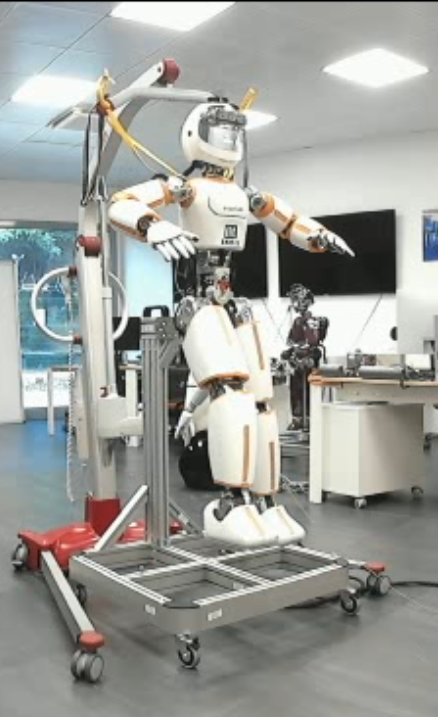 | 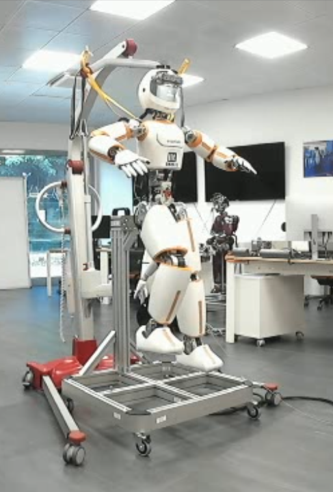 | 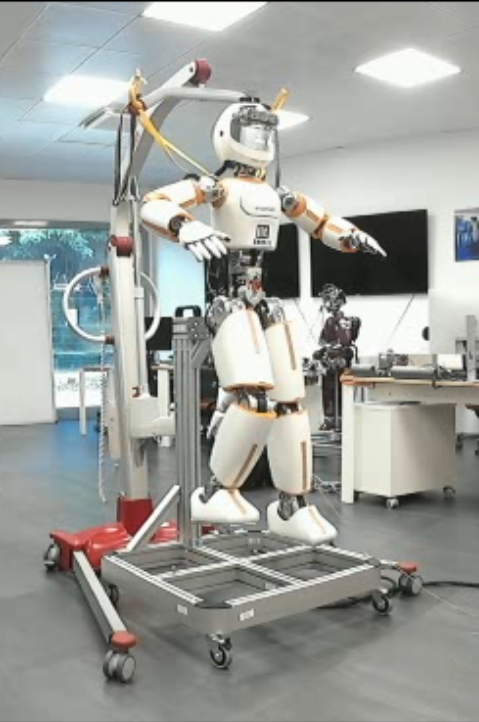 |
  |----------------------------|----------------------------|----------------------------|
  | 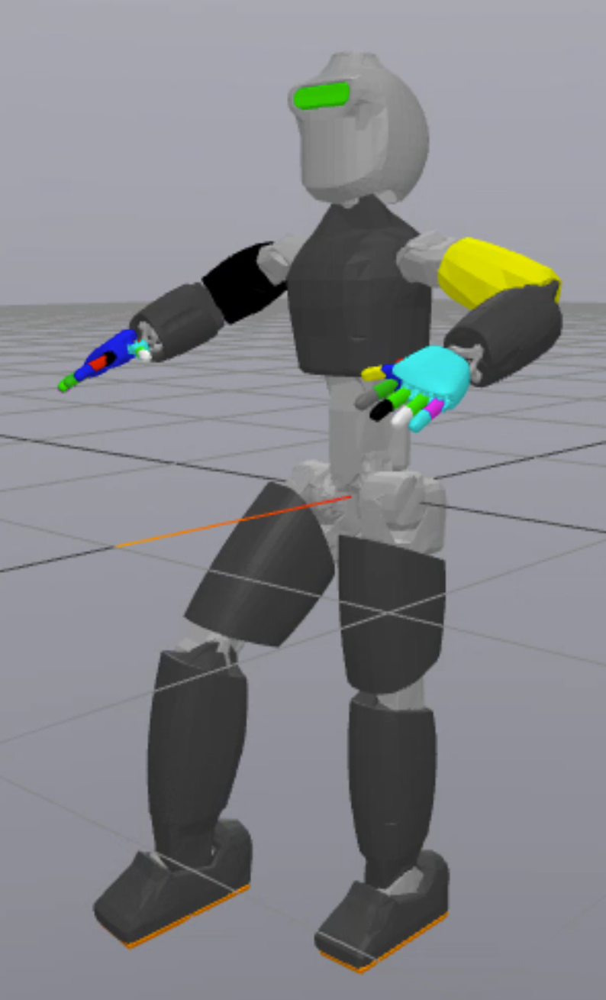   | 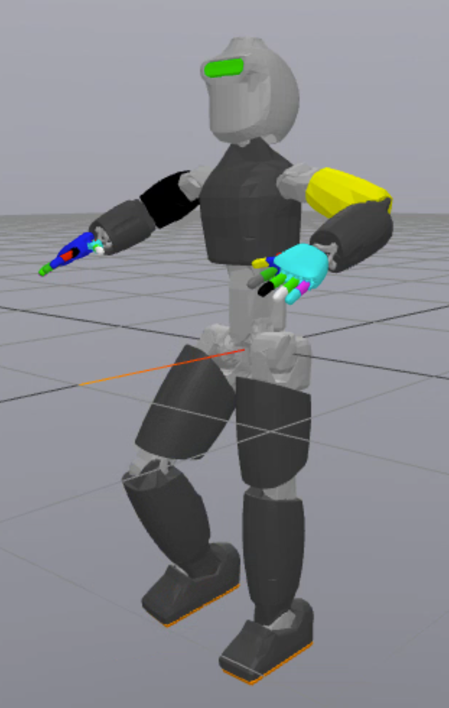   | 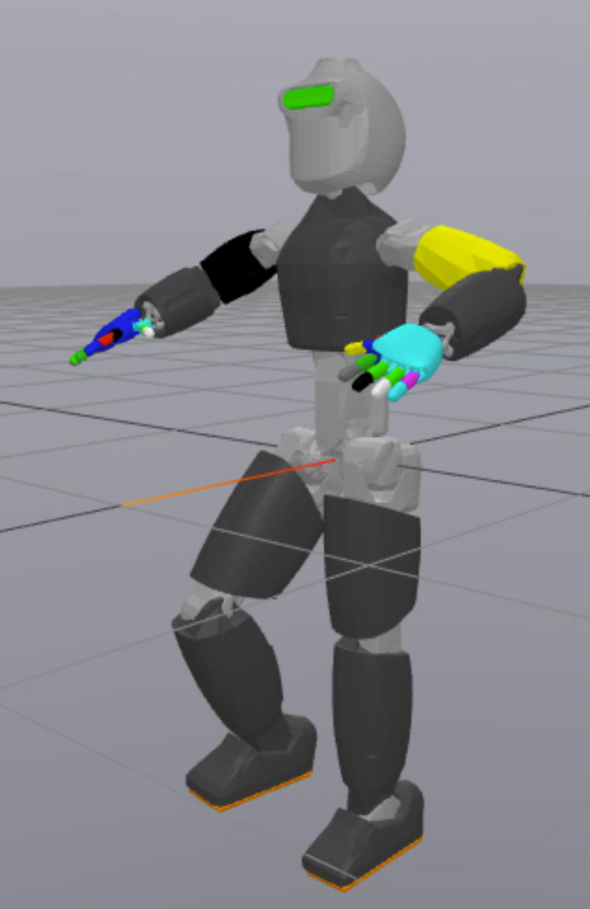   |


## Glossary

| Abbreviation | Description |
|--------------|-------------|
| CD           | Co-design   |
| PB           | Point-based |
| SSDT         | Solution space with disturbance tolerance |
| GT           | Gain-tuning |
| DV           | Design variable |
| QoI           | Quantitiy of interest |
| SSO           | Solution space optimisation |


| Symbol       | Description |
|--------------|-------------|
| $x_K (=x_C) $   | Controller gains DVs (joint level and task level) |
| $\boldsymbol{x}_A$ | Actuator DVs (motor torque and gear ratios)|
|  $\boldsymbol{x}_{N}$   | Gear ratio DVs |
|  $\boldsymbol{x}_{\tau}$   | Motor torque DVs |
|  $\boldsymbol{x}_{SSDT}^*$   | Selected design from SSDT |


## Working with your own walking robot for co-design? 

If you want to setup your own robot for control and design co-optimisation using the pipeline described in the paper, have a look at [CoMoDO](https://github.com/ami-iit/comodo). 


### Maintainer

This repository is maintained by:

| | |
|:---:|:---:|
| [](https://github.com/akhilsathuluri) | [@akhilsathuluri](https://github.com/akhilsathuluri) |
